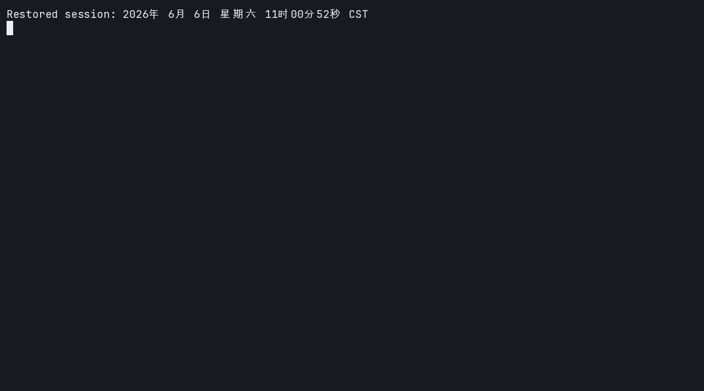
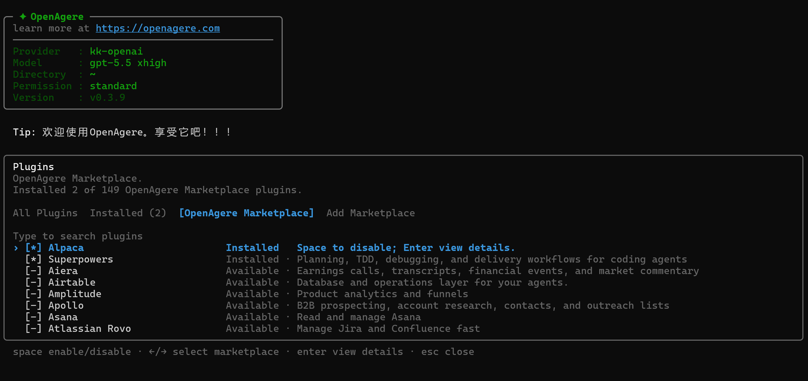

# OpenAgere：开箱即用的终端 AI 编程 Agent

<p align="center">
  
</p>

OpenAgere 是一个基于 Rust 构建的开源终端 AI 编程 Agent，基于 OpenAI Codex CLI 的 Rust 实现二次改造而来，并在模型 Provider、插件系统、国内使用体验、TUI 交互和工程化能力上做了大量增强。

它不是一个简单的命令行聊天工具，而是面向真实开发场景的 Agent：能理解代码仓库、读取项目指令、修改文件、运行命令、审查 diff、恢复历史会话，并通过 MCP、Skills、Plugins 接入更多团队工具。

## 快速上手：只需要 API Key

OpenAgere 的核心目标之一是降低上手成本。

安装后，打开终端运行：

```bash
openagere
```

首次进入后，选择 Provider，填入对应模型服务的 `api_key`，即可开始使用。

如果你已经在项目里，也可以直接运行：

```bash
openagere
```

然后输入需求，例如：

```text
帮我理解这个项目的模块结构，并指出最适合开始阅读的入口文件
```

OpenAgere 会结合当前仓库内容、项目指令和上下文，给出可执行的分析与建议。

## Provider：更适合真实环境的模型接入

<p align="center">
  
</p>

OpenAgere 内置 Provider 管理能力。你可以通过 TUI 中的 `/provider`，或命令行：

```bash
openagere provider
```

快速配置模型服务。

Provider 支持围绕三种协议展开：

- **OpenAI Responses API**：`/v1/responses`
- **Anthropic Messages API**：`/v1/messages`
- **OpenAI Chat Completions API**：`/v1/chat/completions`

它支持：

- OpenAI
- Anthropic
- OpenAI-compatible API
- 自定义 Provider
- 远程 Provider 模板
- 国内常用模型服务配置入口

这意味着很多情况下你不需要手写复杂配置，只要选择 Provider，填入 `api_key`，马上就能开始使用。

对于国内用户，OpenAgere 也提供了更友好的 Provider 模板与国内源支持。由于同时支持 Responses、Anthropic Messages 和 Chat Completions 三类主流协议，国内大多数提供 OpenAI-compatible 或 Anthropic-compatible endpoint 的模型服务都可以快速接入。

## 安装方式

使用 npm：

```bash
npm i -g openagere
openagere
```

使用 Bun：

```bash
bun add -g openagere
openagere
```

OpenAgere 会通过平台相关的 optional dependencies 安装对应原生二进制。启动脚本需要 Node.js 18+。

## Plugin：把团队能力接进 Agent

<p align="center">
  
</p>

OpenAgere 支持 Plugins 和 Skills，可以把团队内部流程、工具、文档、脚本和集成能力封装成可复用能力。

OpenAgere 也兼容 Codex 对应的插件结构：除了 OpenAgere 自身的 `.agere-plugin/plugin.json`，也能识别 `.codex-plugin/plugin.json`，已有 Codex plugin 可以低成本迁移和复用。

例如，你可以用插件扩展：

- 内部研发流程
- 代码审查规范
- 项目脚手架
- API 文档查询
- 数据库或业务系统操作
- MCP 工具集成
- 团队专属 Agent 工作流

这让 OpenAgere 不只是一个通用 AI 编程助手，而可以逐步变成适合团队自己的终端 Agent 平台。

## 为什么选择 OpenAgere

OpenAgere 适合希望快速开始、同时又需要可扩展能力的开发者和团队。

它的特点包括：

- **上手快**：安装后选择 Provider，填入 `api_key` 即可使用。
- **终端原生**：在开发者最熟悉的终端里运行。
- **交互体验强**：提供 Ratatui TUI、流式输出、审批、diff、会话恢复等能力。
- **模型接入灵活**：支持 OpenAI Responses、Anthropic Messages、Chat Completions、OpenAI-compatible API 和自定义 Provider。
- **国内体验友好**：支持国内常用 Provider 模板和源配置，国内大多数模型服务都能快速接入。
- **插件化扩展**：通过 Plugins、Skills、MCP 和 Codex-compatible plugin 接入更多工具。
- **工程化能力完整**：支持代码修改、命令执行、审查 diff、非交互执行和 App Server 集成。
- **基于 Codex 二次改造**：继承 Codex CLI 的核心思路，并针对实际工程场景持续增强。

## 一句话总结

OpenAgere 是一个开箱即用、Provider 友好、插件化、适合国内外开发环境的开源终端 AI 编程 Agent。

只要一个 API Key，就可以马上开始让 AI 理解、修改和协作开发你的代码项目。
